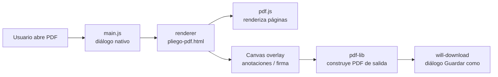

<div align="center">


# Pliego

### Editor de PDF de escritorio para Windows — sin servidores, sin suscripción, sin límites.

<br/>

[](https://www.electronjs.org/)
[](https://github.com/jpinchi/pliego/releases)
[](https://github.com/jpinchi/pliego/releases)
[](LICENSE)
[]()

<br/>

[⬇️ Descargar `.exe`](https://github.com/jpinchi/pliego/releases) · [📖 Ver funciones](#-funciones-destacadas) · [🚀 Instalación](#-cómo-instalarlo)

</div>

---

## ¿Qué es Pliego?

Pliego es una app de escritorio que te permite **editar, firmar y anotar PDFs** directamente en tu PC con Windows, sin subir tus documentos a ningún servidor. Funciona completamente sin conexión a internet y no requiere cuenta ni suscripción. Está pensada para cualquiera que trabaje con documentos PDF a diario: formularios, contratos, reportes o presentaciones.

---

## ✨ Funciones destacadas

- 🖊️ **Anotaciones completas** — dibuja a mano alzada, resalta texto, añade notas, rectángulos, elipses, flechas y líneas directamente sobre el PDF
- ✍️ **Firma digital** — escribe tu firma en varios estilos de fuente, dibújala con el ratón o inserta una imagen; queda incrustada en el PDF
- 📝 **Edición de texto** — coloca cajas de texto editables sobre cualquier página, con soporte para negrita, itálica y diferentes tamaños
- 📋 **Formularios AcroForm** — detecta y rellena campos de formularios PDF existentes sin herramientas externas
- 🔲 **Redacción** — cubre información sensible con bloques opacos (negro o blanco) que se aplanan al guardar
- 🗂️ **Organización de páginas** — inserta PDFs adicionales, agrega imágenes como página nueva, exporta páginas como PNG
- 💧 **Marca de agua** — añade texto como marca de agua con control de opacidad, tamaño y color
- 🔖 **Marcadores y numeración** — crea una tabla de contenidos personalizada y añade numeración de páginas con control de posición y estilo
- 🔍 **Búsqueda** — encuentra texto en todo el documento con resaltado de coincidencias
- 📋 **Metadatos** — edita título, autor, asunto y palabras clave del PDF
- 🖨️ **Imprimir** — imprime directamente desde la app
- 🌙 **Tema claro/oscuro** — cambia el aspecto visual desde los ajustes sin reiniciar
- 🌐 **Bilingüe ES/EN** — interfaz completamente traducida al español e inglés

---

## 🖼️ Galería

> Las capturas se encuentran en [`docs/screenshots/`](docs/screenshots/).

| Vista | Descripción |
|---|---|
|  | **Pantalla principal** — panel de herramientas, vista del PDF y barra superior |
|  | **Anotaciones** — dibujo, resaltado y texto sobre el documento |
|  | **Firma digital** — tres modos: escribir, dibujar o insertar imagen |
|  | **Tema claro** — alternativa para ambientes con luz natural |

---

## 🚀 Cómo instalarlo

### Opción A — Instalador (recomendado)

1. Ve a [**Releases**](https://github.com/jpinchi/pliego/releases)
2. Descarga `Pliego-Setup-1.0.0.exe`
3. Ejecuta el instalador y sigue los pasos
4. Abre Pliego desde el menú Inicio o el acceso directo del escritorio

### Opción B — Versión portable (sin instalar)

1. Descarga `Pliego-1.0.0-portable.exe`
2. Ejecuta directamente — no necesita instalación ni permisos de administrador

### Opción C — Ejecutar desde el código fuente

```bash
git clone https://github.com/jpinchi/pliego.git
cd pliego
npm install
npm start
```

Para generar el instalador `.exe`:

```bash
npm run dist:win
```

> Requiere [Node.js 18+](https://nodejs.org) y [Git](https://git-scm.com/).

---

## ⚙️ Cómo funciona por dentro



### Tecnologías

| Librería | Versión | Rol |
|---|---|---|
| [Electron](https://electronjs.org) | 31 | Shell nativo Windows / proceso principal |
| [pdf.js](https://mozilla.github.io/pdf.js/) | 3.11 | Renderizado de páginas y extracción de texto |
| [pdf-lib](https://pdf-lib.js.org/) | 1.17 | Construcción del PDF de salida con todas las anotaciones |
| electron-builder | 24 | Empaquetado NSIS + portable |
| sharp + png-to-ico | — | Generación del ícono multi-resolución |

> **Sin frameworks de UI.** Todo el renderer es HTML + CSS + JavaScript vanilla en un único archivo (`renderer/pliego-pdf.html`). Menos dependencias, arranque más rápido.

---

## 🧠 Retos y decisiones de diseño

**1. Rotación de páginas y coordenadas de anotaciones**
Los PDFs pueden tener rotación intrínseca en sus metadatos (`/Rotate 90`). Si se dibujan anotaciones en coordenadas de pantalla y luego se aplican al PDF sin corregir, los elementos aparecen desplazados o girados. La solución: al guardar, cualquier página con rotación ≠ 0 se rasteriza a canvas con la orientación visual correcta y se reemplaza por una página nueva con rotación 0. Las anotaciones se dibujan sobre esta página normalizada, lo que garantiza que coordenadas 0-1 sean siempre fiables.

**2. Resize de formas rotadas**
Al redimensionar una figura ya rotada, el punto del cursor (en espacio de pantalla) tiene que deshacerse del ángulo de la figura antes de calcular el nuevo ancho/alto. Esto se resuelve aplicando la inversa de la rotación al cursor alrededor del centro inicial del shape (`rotatePointAround(px, py, cx, cy, -rot)`), convirtiendo el problema rotado en uno alineado con los ejes antes de hacer el delta.

**3. Proceso principal aislado del renderer**
El renderer corre en un sandbox estricto (`sandbox:true`, `nodeIntegration:false`). Para acceder al sistema de archivos, todo pasa por `contextBridge` → IPC → proceso principal. Esto evita que un PDF malicioso pueda ejecutar código Node incluso si lograra inyectar scripts en el renderer.

**4. Bookmarks / tabla de contenidos en pdf-lib**
pdf-lib no tiene una API de alto nivel para `/Outlines`. La solución fue escribir directamente el árbol de objetos del catálogo PDF: cada marcador es un `PDFDict` con referencias `Prev`/`Next`/`Parent`/`First`/`Last` resueltas manualmente, y el array `Dest` apunta al `PDFRef` de la página destino. Rodeado de try/catch para que un fallo no corrompa el PDF completo.

---

## 🔒 Calidad y seguridad

- **Sandbox estricto**: el renderer no tiene acceso a Node.js ni al sistema de archivos directamente
- **Bloqueo de navegación**: `will-navigate` rechaza cualquier URL externa que intente cargar desde el renderer
- **Sin telemetría**: la app no hace ninguna llamada de red; funciona 100% offline
- **XSS mitigado**: todos los textos del usuario que se insertan en el DOM pasan por `escapeHtml()` antes de renderizarse
- **Una sola instancia**: `app.requestSingleInstanceLock()` evita múltiples ventanas accidentales

---

## 🗺️ Próximos pasos

- [ ] Soporte para anotaciones de comentario (sticky notes con hilo de respuestas)
- [ ] Exportar selección de páginas (en vez de siempre el documento completo)
- [ ] Drag & drop de archivos sobre la ventana para abrirlos
- [ ] Firma con certificado digital (PKCS#12)

---

## 📄 Licencia

MIT © [jpinchi](https://github.com/jpinchi)

---

<div align="center">

Hecho con Electron · pdf.js · pdf-lib

**[github.com/jpinchi](https://github.com/jpinchi)**

</div>

---

<details>
<summary>🇺🇸 English summary</summary>

**Pliego** is a Windows desktop PDF editor built with Electron 31. It lets you annotate, sign, redact, fill forms, add watermarks, manage bookmarks and page numbers — all 100% offline, no account or subscription required. The renderer is a single vanilla-JS HTML file using pdf.js for rendering and pdf-lib for generating the output PDF. Download the `.exe` from [Releases](https://github.com/jpinchi/pliego/releases) or clone and run with `npm install && npm start`.

</details>
