<div align="center">

<picture>
  <source media="(max-width: 600px)" srcset="https://raw.githubusercontent.com/jpinchi/pliego/main/docs/readme/banner-m.svg" />
  
</picture>

<br/>

[](https://www.electronjs.org/)
[](https://github.com/jpinchi/pliego/releases)
[](https://github.com/jpinchi/pliego/releases/latest)
[](LICENSE)
[](#seguridad)

<br/>

<a href="https://github.com/jpinchi/pliego/releases/download/v1.0.0/Pliego.Setup.1.0.0.exe"></a>
<a href="https://github.com/jpinchi/pliego/releases/download/v1.0.0/Pliego.1.0.0.exe"></a>
<a href="#funciones"></a>

</div>

<br/>

<a id="que-es"></a>
<picture>
  <source media="(max-width: 600px)" srcset="https://raw.githubusercontent.com/jpinchi/pliego/main/docs/readme/h-que-es-m.svg" />
  
</picture>

Pliego es una app de escritorio que te permite **editar, firmar y anotar PDFs** directamente en tu PC con Windows, sin subir tus documentos a ningún servidor. Funciona completamente sin conexión a internet y no requiere cuenta ni suscripción. Está pensada para cualquiera que trabaje con documentos PDF a diario: formularios, contratos, reportes o presentaciones.

<picture>
  <source media="(max-width: 600px)" srcset="https://raw.githubusercontent.com/jpinchi/pliego/main/docs/readme/pilares-m.svg" />
  
</picture>

<br/><br/>

<a id="galeria"></a>
<picture>
  <source media="(max-width: 600px)" srcset="https://raw.githubusercontent.com/jpinchi/pliego/main/docs/readme/h-galeria-m.svg" />
  
</picture>

<picture>
  <source media="(max-width: 600px)" srcset="https://raw.githubusercontent.com/jpinchi/pliego/main/docs/readme/galeria-m.svg" />
  
</picture>

<details>
<summary><b>Ver las capturas en tamaño completo</b></summary>

<br/>

| Vista | Descripción |
|---|---|
| 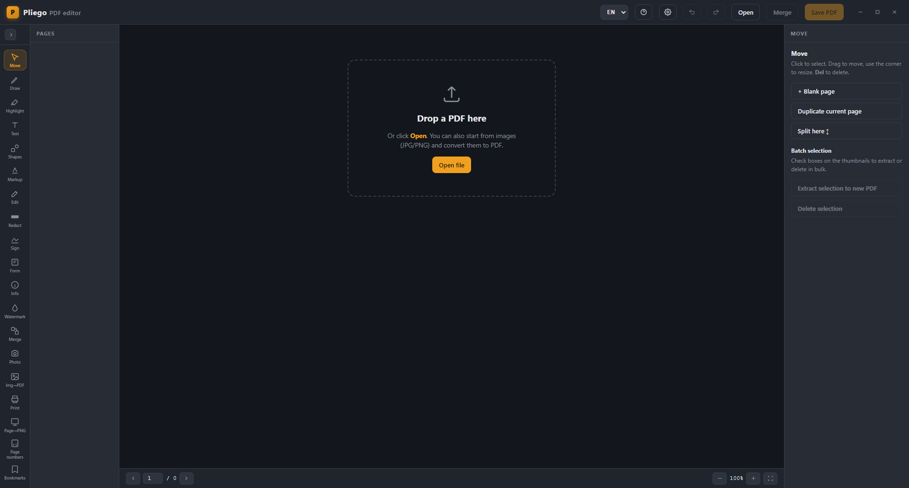 | **Pantalla principal** — un PDF anotado y firmado, con el panel de herramientas y las páginas |
| 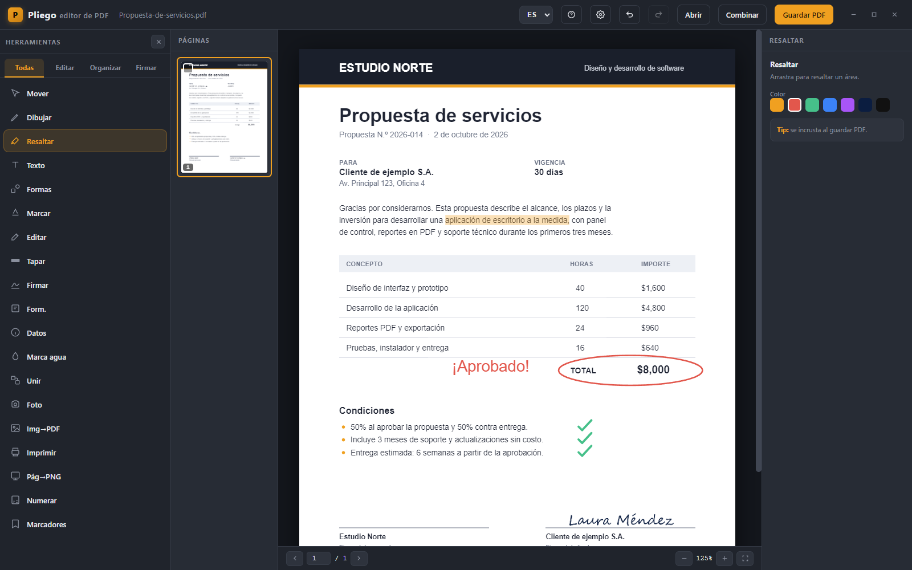 | **Anotaciones** — resaltado, formas, dibujo a mano y texto sobre el documento |
| 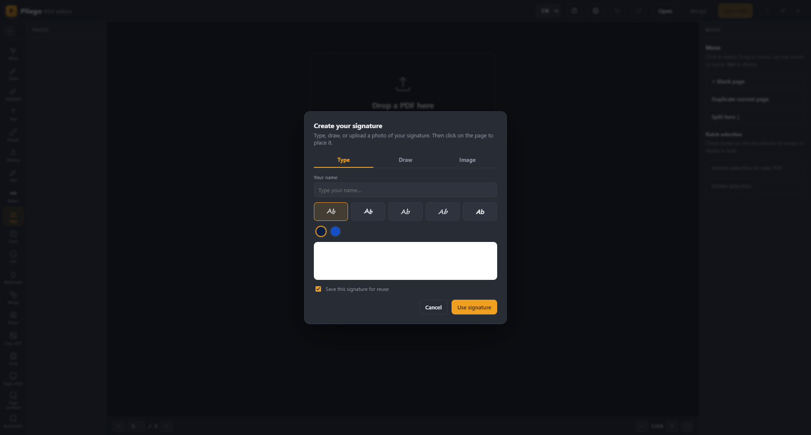 | **Firma digital** — tres modos: escribir, dibujar o insertar imagen |
| 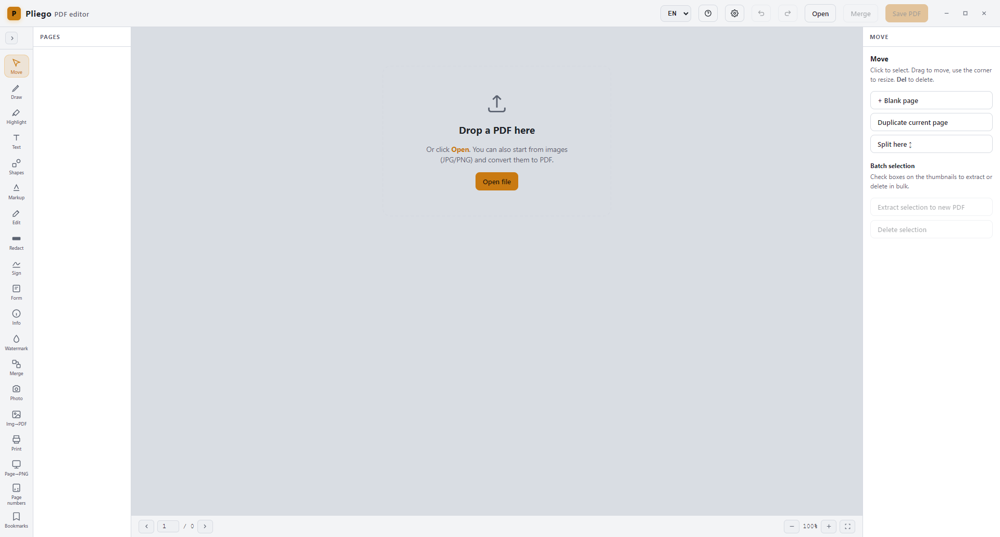 | **Tema claro** — alternativa para ambientes con luz natural |

> Las capturas están en [`docs/screenshots/`](docs/screenshots/). Para regenerarlas: `npm install` y luego `node docs/screenshots/capture.mjs`.

</details>

<br/>

<a id="funciones"></a>
<picture>
  <source media="(max-width: 600px)" srcset="https://raw.githubusercontent.com/jpinchi/pliego/main/docs/readme/h-funciones-m.svg" />
  
</picture>

<picture>
  <source media="(max-width: 600px)" srcset="https://raw.githubusercontent.com/jpinchi/pliego/main/docs/readme/funciones-m.svg" />
  
</picture>

<br/><br/>

<a id="instalacion"></a>
<picture>
  <source media="(max-width: 600px)" srcset="https://raw.githubusercontent.com/jpinchi/pliego/main/docs/readme/h-instalacion-m.svg" />
  
</picture>

### Opción A — Instalador (recomendado)

1. Ve a [**Releases**](https://github.com/jpinchi/pliego/releases)
2. Descarga `Pliego.Setup.1.0.0.exe`
3. Ejecuta el instalador y sigue los pasos
4. Abre Pliego desde el menú Inicio o el acceso directo del escritorio

### Opción B — Versión portable (sin instalar)

1. Descarga `Pliego.1.0.0.exe` desde [**Releases**](https://github.com/jpinchi/pliego/releases)
2. Ejecuta directamente — no necesita instalación ni permisos de administrador

### Opción C — Ejecutar desde el código fuente

```bash
git clone https://github.com/jpinchi/pliego.git
cd pliego
npm install
npm start
```

Para generar el instalador `.exe`:

```bash
npm run dist:win
```

> Requiere [Node.js 20.9+](https://nodejs.org) y [Git](https://git-scm.com/).

<br/>

<a id="como-funciona"></a>
<picture>
  <source media="(max-width: 600px)" srcset="https://raw.githubusercontent.com/jpinchi/pliego/main/docs/readme/h-como-funciona-m.svg" />
  
</picture>

<picture>
  <source media="(max-width: 600px)" srcset="https://raw.githubusercontent.com/jpinchi/pliego/main/docs/readme/flujo-m.svg" />
  
</picture>

<picture>
  <source media="(max-width: 600px)" srcset="https://raw.githubusercontent.com/jpinchi/pliego/main/docs/readme/tecnologias-m.svg" />
  
</picture>

> **Sin frameworks de UI.** Todo el renderer es HTML + CSS + JavaScript vanilla en un único archivo (`renderer/pliego-pdf.html`). Menos dependencias, arranque más rápido. El ícono multi-resolución se genera con sharp + png-to-ico.

<br/>

<a id="retos"></a>
<picture>
  <source media="(max-width: 600px)" srcset="https://raw.githubusercontent.com/jpinchi/pliego/main/docs/readme/h-retos-m.svg" />
  
</picture>

**1. Rotación de páginas y coordenadas de anotaciones**
Los PDFs pueden tener rotación intrínseca en sus metadatos (`/Rotate 90`). Si se dibujan anotaciones en coordenadas de pantalla y luego se aplican al PDF sin corregir, los elementos aparecen desplazados o girados. La solución: al guardar, cualquier página con rotación ≠ 0 se rasteriza a canvas con la orientación visual correcta y se reemplaza por una página nueva con rotación 0. Las anotaciones se dibujan sobre esta página normalizada, lo que garantiza que coordenadas 0-1 sean siempre fiables.

**2. Resize de formas rotadas**
Al redimensionar una figura ya rotada, el punto del cursor (en espacio de pantalla) tiene que deshacerse del ángulo de la figura antes de calcular el nuevo ancho/alto. Esto se resuelve aplicando la inversa de la rotación al cursor alrededor del centro inicial del shape (`rotatePointAround(px, py, cx, cy, -rot)`), convirtiendo el problema rotado en uno alineado con los ejes antes de hacer el delta.

**3. Proceso principal aislado del renderer**
El renderer corre en un sandbox estricto (`sandbox:true`, `nodeIntegration:false`). Para acceder al sistema de archivos, todo pasa por `contextBridge` → IPC → proceso principal. Esto evita que un PDF malicioso pueda ejecutar código Node incluso si lograra inyectar scripts en el renderer.

**4. Bookmarks / tabla de contenidos en pdf-lib**
pdf-lib no tiene una API de alto nivel para `/Outlines`. La solución fue escribir directamente el árbol de objetos del catálogo PDF: cada marcador es un `PDFDict` con referencias `Prev`/`Next`/`Parent`/`First`/`Last` resueltas manualmente, y el array `Dest` apunta al `PDFRef` de la página destino. Rodeado de try/catch para que un fallo no corrompa el PDF completo.

<br/>

<a id="seguridad"></a>
<picture>
  <source media="(max-width: 600px)" srcset="https://raw.githubusercontent.com/jpinchi/pliego/main/docs/readme/h-seguridad-m.svg" />
  
</picture>

<picture>
  <source media="(max-width: 600px)" srcset="https://raw.githubusercontent.com/jpinchi/pliego/main/docs/readme/seguridad-m.svg" />
  
</picture>

<br/><br/>

<a id="proximos"></a>
<picture>
  <source media="(max-width: 600px)" srcset="https://raw.githubusercontent.com/jpinchi/pliego/main/docs/readme/h-proximos-m.svg" />
  
</picture>

- [ ] Soporte para anotaciones de comentario (sticky notes con hilo de respuestas)
- [ ] Firma con certificado digital (PKCS#12)

<br/>

<picture>
  <source media="(max-width: 600px)" srcset="https://raw.githubusercontent.com/jpinchi/pliego/main/docs/readme/pie-m.svg" />
  
</picture>

<div align="center">

[Licencia MIT](LICENSE) · [github.com/jpinchi](https://github.com/jpinchi)

</div>

<details>
<summary>🇺🇸 English summary</summary>

**Pliego** is a Windows desktop PDF editor built with Electron 31. It lets you annotate, sign, redact, fill forms, add watermarks, manage bookmarks and page numbers — all 100% offline, no account or subscription required. The renderer is a single vanilla-JS HTML file using pdf.js for rendering and pdf-lib for generating the output PDF. Download the `.exe` from [Releases](https://github.com/jpinchi/pliego/releases) or clone and run with `npm install && npm start`.

</details>
